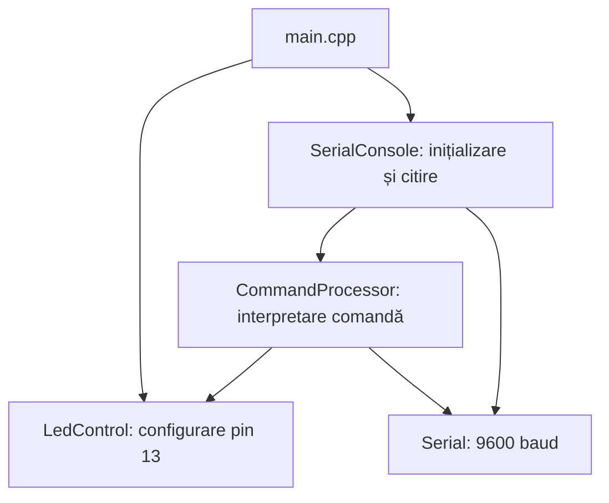
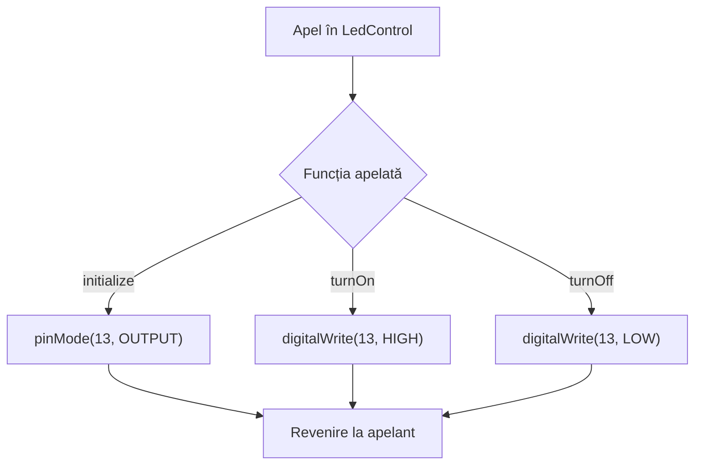
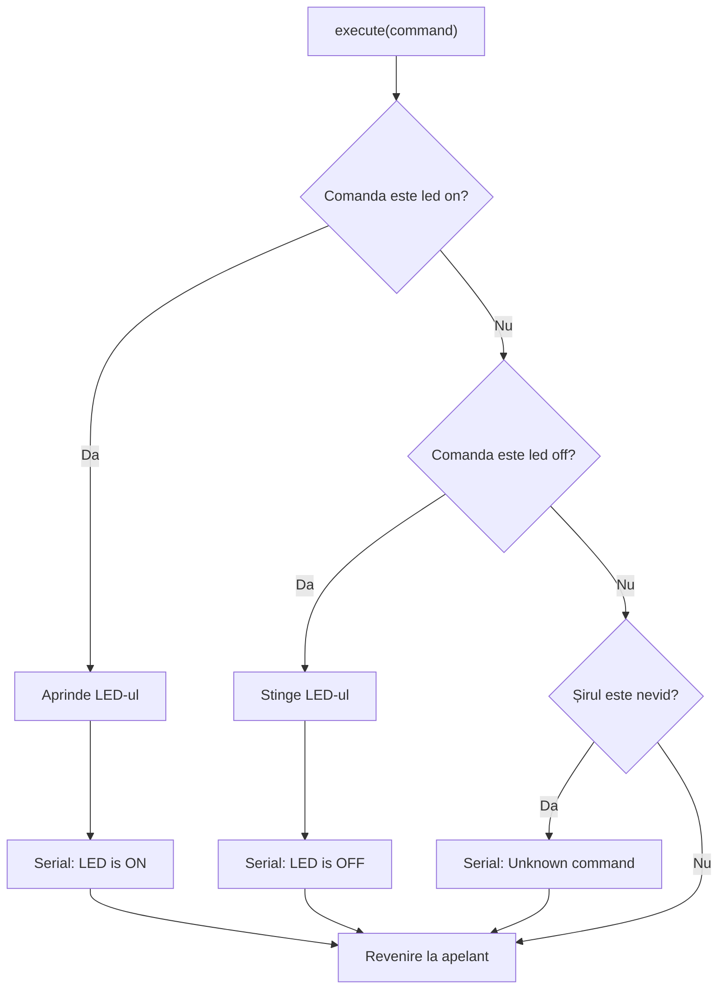
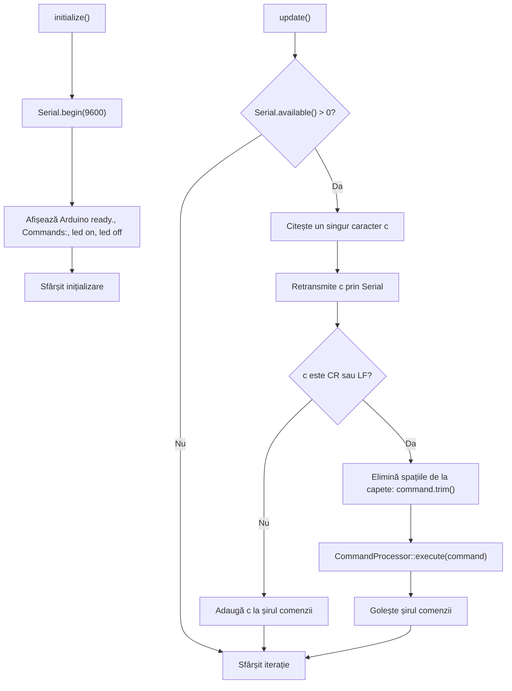
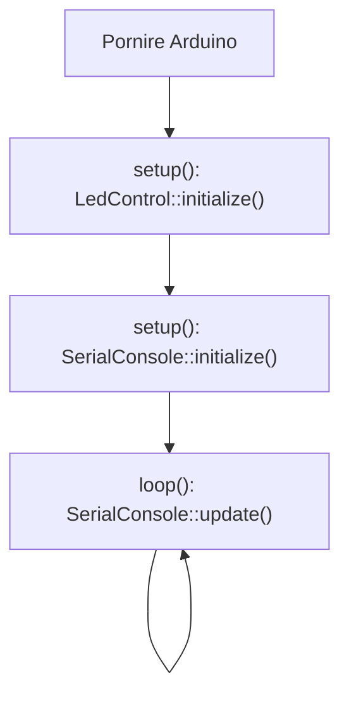

# Laboratorul 1, partea 1 — Implementarea modulară

Aplicația controlează LED-ul de pe pinul 13 al plăcii Arduino Mega 2560 prin
comenzile seriale `led on` și `led off`. Comunicarea se realizează la 9600 baud.
Fiecare caracter primit este retransmis prin Serial înainte de prelucrare (echo).

## Separarea interfeței de implementare

Fiecare modul are un antet `.h` în `include/`, care declară și explică funcțiile
disponibile, și un fișier `.cpp` în `src/`, care implementează operațiile și
explică secvențele critice. Pinul LED-ului și șirul comenzii sunt private
implementărilor, fiind declarate în spații de nume anonime.

| Modul | Interfață | Implementare | Rol |
| --- | --- | --- | --- |
| Control LED | `include/led_control.h` | `src/led_control.cpp` | Configurarea pinului și comanda LED-ului |
| Procesare comenzi | `include/command_processor.h` | `src/command_processor.cpp` | Recunoașterea comenzilor și raportarea rezultatului |
| Consolă serială | `include/serial_console.h` | `src/serial_console.cpp` | Inițializare Serial, citire, echo și acumularea comenzii |
| Punct de intrare | Funcțiile standard Arduino | `src/main.cpp` | Inițializare prin `setup()` și execuție repetată prin `loop()` |

PlatformIO compilează fișierele din `src/` și caută antetele proiectului în
`include/`. Fișierul `platformio.ini` și configurația simulatorului sunt păstrate.
Bibliotecile deja declarate în configurație nu au fost modificate.

Schemele bloc funcționale sunt incluse mai jos în format Mermaid. Pentru
afișarea lor grafică se folosește un cititor Markdown cu suport Mermaid.

## Arhitectura aplicației



## 1. Modulul led_control

| Funcție | Operație |
| --- | --- |
| `initialize()` | Configurează pinul 13 ca `OUTPUT`, fără scrierea unui nivel inițial |
| `turnOn()` | Scrie `HIGH` pe pinul 13 |
| `turnOff()` | Scrie `LOW` pe pinul 13 |

Inițializarea păstrează exact operația din programul original: `pinMode()`.
Nu se adaugă un apel `digitalWrite()` în `setup()`.



## 2. Modulul command_processor

`execute(const String &command)` primește comanda după eliminarea spațiilor de
la capete de către consola serială. Nu modifică șirul primit. Compararea este
exactă și sensibilă la litere mari/mici. Modificarea LED-ului precedă mesajul de
confirmare. Comenzile necunoscute și comenzile goale nu modifică LED-ul.



## 3. Modulul serial_console

`initialize()` pornește Serial la 9600 baud și afișează, pe linii separate,
mesajele originale: `Arduino ready.`, `Commands:`, `led on`, `led off`.

`update()` citește cel mult un caracter pe apel. Fiecare caracter este transmis
înapoi, inclusiv terminatorii de linie. Caracterele obișnuite sunt adăugate la
șirul intern. La `\r` (CR) sau `\n` (LF), funcția aplică `String::trim()`,
apelează procesorul și golește șirul. Nu sunt adăugate întârzieri, limite de
lungime sau interpretări speciale pentru alte caractere.



Pentru CRLF, CR finalizează comanda, iar LF finalizează apoi un șir gol.
Procesorul ignoră șirul gol, astfel că o comandă validă are o singură confirmare.
Ambele caractere de terminare sunt totuși retransmise prin echo.

## 4. Punctul de intrare main.cpp

`setup()` inițializează LED-ul înaintea comunicației seriale, păstrând ordinea
originală. `loop()` apelează repetat consola serială.



## Comportamentul păstrat și scenarii de verificare

În tabel, `\n` și `\r` reprezintă caractere de terminare, nu textul literal.
Toate caracterele de intrare sunt retransmise prin echo. Coloana rezultatului
descrie mesajul suplimentar și efectul asupra LED-ului.

| Intrare / acțiune | Rezultat așteptat |
| --- | --- |
| Pornire | Cele patru linii de întâmpinare și ajutor, în ordinea originală |
| `led on\n` | LED aprins și `LED is ON` |
| `led off\r` | LED stins și `LED is OFF` |
| `led on\r\n` | LED aprins, o singură confirmare `LED is ON` |
| `  led on  \n` | Spațiile de la capete sunt eliminate; LED aprins |
| `LED ON\n` | `Unknown command`; LED nemodificat |
| `led  on\n` | `Unknown command`; spațiile interioare nu sunt eliminate |
| `abc\n` | `Unknown command`; LED nemodificat |
| `\n` sau `   \r\n` | Fără mesaj de rezultat; LED nemodificat |
| `led on` fără terminator | Numai echo; comanda așteaptă CR sau LF |
| `led on\nled off\n` | Aprindere și apoi stingere, cu ambele confirmări |
| Nicio intrare serială | Nicio modificare a stării aplicației |

Compilarea pentru placa configurată se execută din directorul proiectului:

```text
pio run -e mega2560
```

Scenariile de mai sus sunt rezultate așteptate pentru verificarea pe placă sau
în simulator; nu reprezintă teste executate pe hardware.
