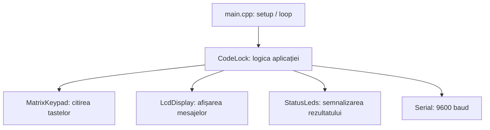
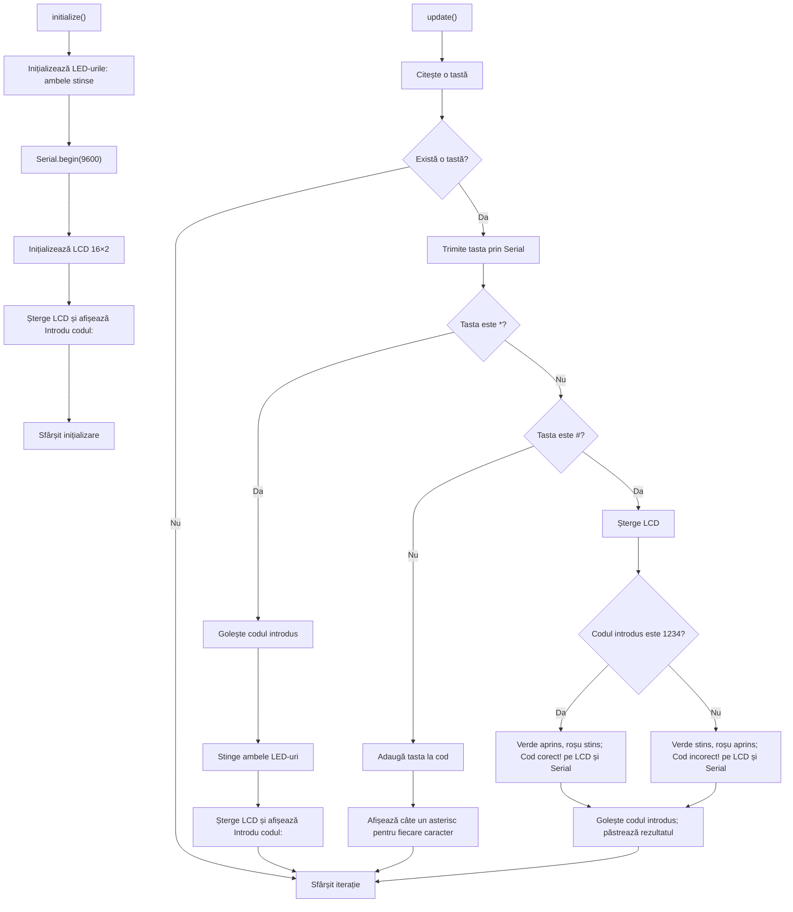
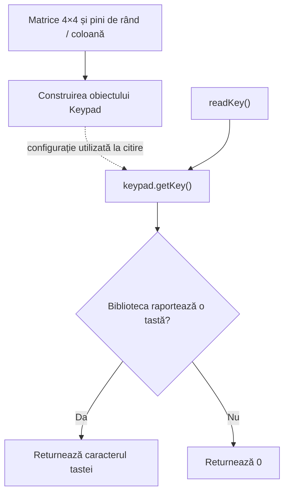
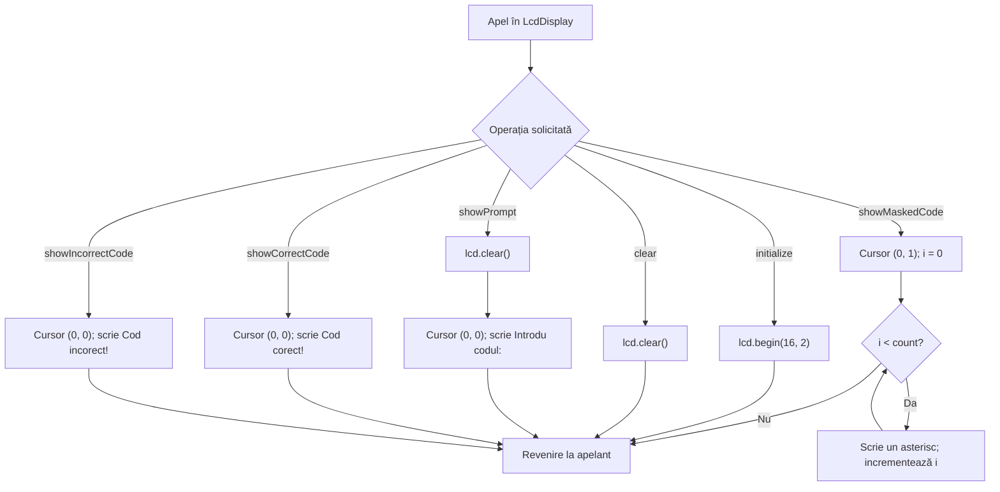
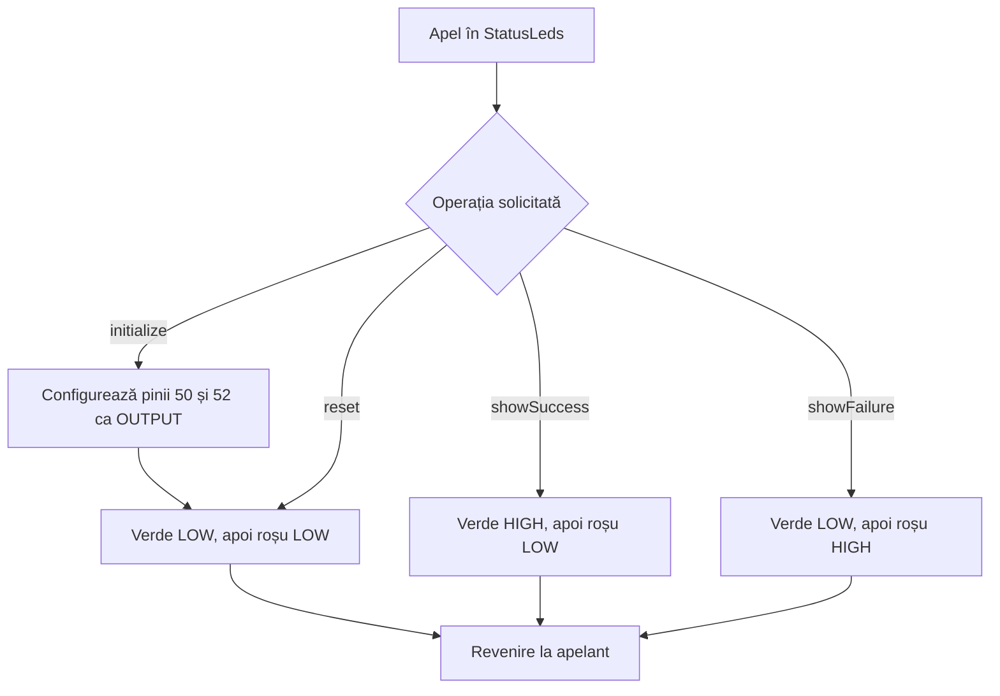
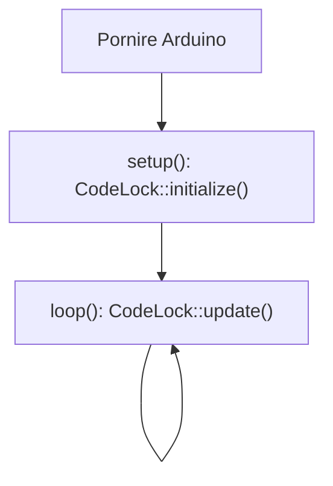

# Implementarea modulară a sistemului de verificare a codului

Programul pentru Arduino Mega 2560 este împărțit în patru module, fiecare cu
interfață în `include/*.h` și implementare în `src/*.cpp`. Fișierul `main.cpp`
păstrează punctele de intrare Arduino `setup()` și `loop()`.

Interfețele explică operațiile disponibile. Implementările conțin configurația
hardware, starea internă și comentarii pentru secvențele critice. Obiectele și
variabilele din spațiile de nume anonime sunt private fișierelor `.cpp`.

Schemele bloc folosesc Mermaid și pot fi vizualizate într-un cititor Markdown
cu suport Mermaid.

## Structura fișierelor

| Componentă | Interfață | Implementare | Responsabilitate |
| --- | --- | --- | --- |
| Aplicație | `include/code_lock.h` | `src/code_lock.cpp` | Inițializare, cod introdus, verificare și mesaje seriale |
| Tastatură | `include/matrix_keypad.h` | `src/matrix_keypad.cpp` | Configurarea matricei 4×4 și citirea tastelor |
| Afișaj | `include/lcd_display.h` | `src/lcd_display.cpp` | Configurarea LCD-ului și afișarea mesajelor |
| Semnalizare | `include/status_leds.h` | `src/status_leds.cpp` | Configurarea și comanda LED-urilor |
| Punct de intrare | Interfața standard Arduino | `src/main.cpp` | Apelarea aplicației din `setup()` și `loop()` |

Fișierele din `src/` sunt compilate de PlatformIO, iar antetele sunt incluse din
`include/`. Configurația `platformio.ini` și conexiunile hardware sunt păstrate.

## Relațiile dintre componente



## 1. Modulul aplicației — code_lock

`initialize()` configurează LED-urile, pornește comunicația serială, configurează
LCD-ul și afișează invitația. `update()` citește și procesează cel mult o tastă la
fiecare apel. Codul corect `1234` și șirul introdus sunt private acestui modul.



## 2. Modulul tastaturii — matrix_keypad

`readKey()` returnează caracterul furnizat de `Keypad::getKey()` sau `0` dacă nu
există o tastă nouă. Detectarea tastelor rămâne responsabilitatea bibliotecii.
Nu se adaugă întârzieri sau filtrări.

Rândurile folosesc pinii **34, 36, 38, 40**, iar coloanele **42, 44, 46, 48**.
Matricea păstrează rândurile `1 2 3 A`, `4 5 6 B`, `7 8 9 C`, `* 0 # D`.
Obiectul tastaturii este construit global, ca în programul inițial; modulul nu
necesită un apel separat de inițializare din `setup()`.



## 3. Modulul afișajului — lcd_display

LCD-ul utilizează pinii **22, 24, 26, 28, 30, 32**, în ordinea RS, E, D4, D5,
D6, D7, și este configurat pentru **16 coloane și 2 rânduri**.

| Funcție | Operație |
| --- | --- |
| `initialize()` | Configurează dimensiunile LCD-ului |
| `clear()` | Șterge afișajul |
| `showPrompt()` | Șterge afișajul și scrie `Introdu codul:` la poziția `(0, 0)` |
| `showCorrectCode()` | Scrie `Cod corect!` la poziția `(0, 0)`, fără ștergere prealabilă |
| `showIncorrectCode()` | Scrie `Cod incorect!` la poziția `(0, 0)`, fără ștergere prealabilă |
| `showMaskedCode(count)` | Scrie `count` asteriscuri începând de la poziția `(0, 1)` |

Coordonatele sunt numerotate de la zero. La verificare, aplicația apelează
`clear()` înainte de compararea codului. Afișarea asteriscurilor nu șterge ecranul
și nu trunchiază șirul la lățimea LCD-ului, păstrând comportamentul inițial.



## 4. Modulul LED-urilor — status_leds

LED-ul verde folosește pinul **50**, iar LED-ul roșu pinul **52**.
`initialize()` configurează ambii pini ca ieșiri și apelează `reset()`.
Fiecare schimbare scrie explicit ambele ieșiri, în ordinea verde, apoi roșu.

| Funcție | LED verde | LED roșu |
| --- | --- | --- |
| `reset()` | LOW — stins | LOW — stins |
| `showSuccess()` | HIGH — aprins | LOW — stins |
| `showFailure()` | LOW — stins | HIGH — aprins |



## 5. Punctul de intrare — main.cpp

`main.cpp` folosește interfața modulului aplicației. Funcțiile standard Arduino
sunt păstrate, fără adăugarea unor întârzieri în bucla principală.



## Comportamentul păstrat

- Codul corect este `1234`; comparația se face cu întregul șir introdus.
- Fiecare tastă detectată este raportată prin `Tasta apasata: ` urmat de tastă
  și sfârșit de linie, la 9600 baud.
- `*` golește codul, stinge ambele LED-uri și reface mesajul inițial.
- `#` șterge LCD-ul, verifică șirul, semnalizează rezultatul pe LED-uri, LCD și
  Serial, apoi golește numai șirul introdus.
- Un șir gol verificat cu `#` este incorect.
- Celelalte taste, inclusiv `A`, `B`, `C` și `D`, sunt adăugate la șir.
- Nu există o limită nouă de lungime sau validare suplimentară a tastelor.
- După verificare, rezultatul și LED-urile rămân în starea stabilită. Introducerea
  altor caractere rescrie asteriscurile de pe al doilea rând fără să șteargă
  mesajul rezultatului sau să schimbe LED-urile.
- În absența unei taste, nu se schimbă afișajul, LED-urile sau codul introdus.

## Verificare

Compilarea proiectului pentru placa configurată se execută cu:

```text
pio run -e mega2560
```

Versiunea inițială și versiunea modulară au fost compilate cu succes pentru
`mega2560`. Versiunea modulară utilizează 449 octeți RAM și 6504 octeți Flash.
Verificarea a inclus revizuirea ramurilor de procesare și a apelurilor hardware;
scenariile de mai jos nu au fost executate pe placă sau în simulator.

Pentru verificarea comportamentului pe placă sau în simulator se pot folosi
următoarele scenarii. Acestea descriu rezultatele așteptate.

| Secvență / acțiune | Rezultat așteptat |
| --- | --- |
| Pornire | `Introdu codul:`, ambele LED-uri stinse |
| `1234#` după pornire sau resetare | `Cod corect!`, verde aprins, roșu stins |
| `12#` după resetare | `Cod incorect!`, verde stins, roșu aprins |
| `#` după resetare | Cod incorect pentru șirul gol |
| `12*` | Șir gol, invitația inițială, ambele LED-uri stinse |
| `A#` după resetare | Un asterisc la introducere, apoi cod incorect |
| `1234#5` după resetare | Mesajul de succes și LED-ul verde se păstrează; apare un asterisc pe rândul doi |
| `1234##` după resetare | Prima verificare corectă, a doua incorectă deoarece șirul a fost golit |
| Nicio tastă | Starea aplicației rămâne neschimbată |
