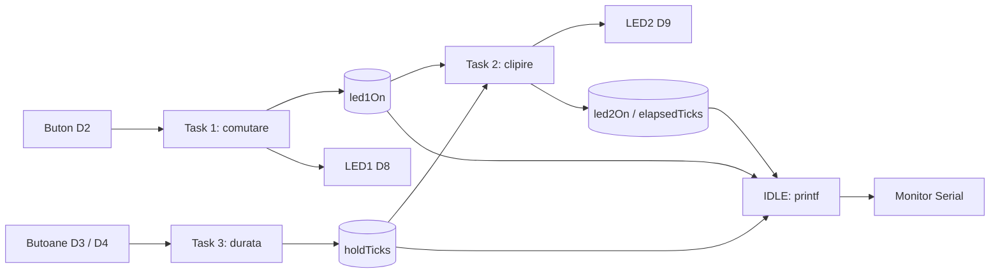
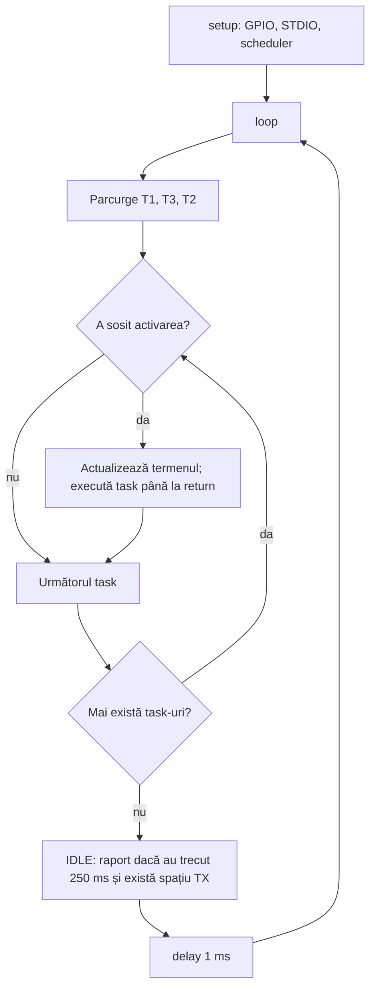

# Laborator 2.1 — Sisteme secvențiale

Proiect PlatformIO pentru **Arduino Mega 2560**, cu trei task-uri periodice,
planificare cooperativă și raportare STDIO prin USB/Serial la **115200 baud**.
Task-urile se execută pe rând, până la terminare: comportamentul pare paralel,
dar nu există fire de execuție sau preempție între task-uri.

## 1. Conectarea fizică

Deconectează USB-ul cât montezi circuitul. Ai nevoie de **2 LED-uri, 2 rezistoare
de 220 Ω (câte unul pentru fiecare LED), 3 butoane**, breadboard și fire.
Numerotarea D2, D3 etc. se referă la inscripțiile de pe placa Mega.

| Element | Conexiune la Mega 2560 | Cealaltă conexiune |
|---|---|---|
| Masă comună | GND → bara „−” a breadboardului | Toate retururile merg aici |
| B1: schimbă LED1 | D2 → un contact al butonului | Celălalt contact → GND |
| B+: crește durata | D3 → un contact al butonului | Celălalt contact → GND |
| B−: scade durata | D4 → un contact al butonului | Celălalt contact → GND |
| LED1 (de exemplu roșu) | D8 → rezistor 220 Ω → anod LED1 | Catod LED1 → GND |
| LED2 (de exemplu verde) | D9 → rezistor 220 Ω → anod LED2 | Catod LED2 → GND |
| Alimentare și terminal | Cablu USB între calculator și Mega | — |

**Anodul** este de obicei piciorul lung; **catodul** este piciorul scurt,
pe partea cu marginea teșită. Rezistorul poate fi și după LED, în serie.
Nu conecta LED-urile direct între pin și GND fără rezistor.

Butoanele folosesc `INPUT_PULLUP`: rezistența internă ține intrarea la HIGH,
iar apăsarea o leagă la GND (LOW). Nu este necesar fir la 5 V sau rezistor
extern pentru butoane. La un buton cu patru piciorușe există două perechi deja
unite intern. Folosește câte un picior din **perechi diferite**, care se unesc
numai la apăsare; verifică cu multimetrul dacă forma butonului nu este clară.
Dacă folosești mai multe bare de masă, unește-le: unele breadboarduri au bare
întrerupte la mijloc.

Schema electrică: [docs/schema-electrica.svg](docs/schema-electrica.svg).

```text
D8 ──[220 Ω]── A LED1 K ── GND
D9 ──[220 Ω]── A LED2 K ── GND
D2 ──[ B1, normal deschis ]── GND
D3 ──[ B+, normal deschis ]── GND
D4 ──[ B−, normal deschis ]── GND
```

## 2. Compilare, încărcare și monitorizare

1. Deschide acest folder în VS Code cu extensia PlatformIO.
2. Conectează Mega printr-un cablu USB care permite transfer de date.
3. Rulează **PlatformIO: Build** (bifa din bara de jos).
4. Rulează **PlatformIO: Upload** (săgeata). Configurația folosește deja
   `board = megaatmega2560`.
5. Deschide **PlatformIO: Serial Monitor**, viteza **115200**.

Din terminalul PlatformIO poți folosi:

```powershell
pio run
pio run --target upload
pio device monitor --baud 115200
```

Dacă sunt mai multe porturi, identifică placa în Device Manager → Ports și
adaugă `upload_port = COMx` și `monitor_port = COMx` în `platformio.ini`,
înlocuind `COMx` cu portul real. Închide alte terminale care ocupă acel port.

## 3. Ce trebuie să observi

- La pornire, LED1 este stins, iar LED2 începe să clipească.
- B1 aprinde LED1 și stinge imediat LED2. O nouă apăsare stinge LED1 și
  permite reluarea clipirii, începând cu LED2 aprins.
- B+ crește `N` cu 1; B− îl scade cu 1. Intervalul este **5…100**, inițial 25.
- Durata fiecărei stări a LED2 este nominal **N × 20 ms**. Inițial:
  500 ms aprins + 500 ms stins, adică un ciclu complet de o secundă.
- B+ face clipirea mai lentă, B− mai rapidă. Modificarea duratei reia
  numărarea stării curente de la zero la următoarea execuție a Task 2.
- O apăsare lungă produce un singur eveniment. Pentru încă un pas, eliberează
  butonul și apasă din nou. Evenimentele +/− validate în aceeași execuție se anulează;
  apăsările decalate se procesează separat.
- Durata se poate regla și când LED1 este aprins; se va folosi la reluare.

Exemplu **ilustrativ**, nu măsurătoare preluată de pe o placă:

```text
t=250 L1=0 L2=1 N=25 k=12 skip=0
t=500 L1=0 L2=1 N=25 k=24 skip=0
t=750 L1=0 L2=0 N=25 k=12 skip=0
```

`t`: milisecunde de la pornire; `L1/L2`: stări logice; `N`: recurențe per
stare; `k`: recurențe deja numărate în starea curentă; `skip`: activări
periodice ratate din cauza întârzierilor. În condiții normale `skip` rămâne 0.
Raportarea la 250 ms este un eșantion al stării: la clipire rapidă poate să nu
surprindă fiecare tranziție.

## 4. Arhitectură și planificare

| Task | Perioadă | Offset | Rol |
|---|---:|---:|---|
| T1 — Button LED | 10 ms | 0 ms | Citește B1; publică `led1On`; comandă LED1 |
| T3 — Variabilă de stare | 10 ms | 2 ms | Citește B+/B−; publică `holdTicks` |
| T2 — LED intermitent | 20 ms | 4 ms | Consumă cele două semnale; comandă LED2 |
| IDLE — raportare | verificat în fiecare buclă, raport la ≥250 ms | — | Citește starea și apelează `printf()` |

Offset-urile sunt relative la inițializarea planificatorului. Într-o fereastră
de 20 ms, activările nominale sunt T1@0, T3@2, T2@4, T1@10 și T3@12.
T1 și T3 publică înainte de T2. Offset-urile nu garantează timp real strict:
un task întârziat poate întârzia următoarele apeluri. Eșantionarea la 10 ms și
anti-rebondul de 30 ms dau un răspuns uzual de aproximativ 30–40 ms la butoane.



Interblocarea din T1 stinge LED2 și resetează `elapsedTicks` înainte să aprindă
LED1. Aceasta este singura excepție explicită de la publicarea stării LED2
exclusiv în T2 și previne aprinderea simultană între două activări ale T2.

Modelul provider/consumer folosește instanța globală `appState`. Semnalele
rețin ultima valoare, nu o coadă de evenimente. Nu trebuie mutex sau `volatile`,
deoarece toate citirile și scrierile au loc secvențial în `loop()`, nu în ISR.
Întreruperile interne Arduino pentru timp și UART rămân active; ele nu execută
task-urile aplicației.



Planificatorul păstrează faza perioadelor și sare peste activările vechi dacă
apare o întârziere mare, în loc să execute multe apeluri instantaneu. `skip`
face vizibilă această situație. Numărul `N` măsoară execuții efective T2:
la suprasarcină, durata reală poate depăși `N × 20 ms`. Diferențele de timp
sunt calculate și peste revenirea `millis()` la zero.

`printf()` este STDIO real: `stdout` este asociat unei funcții care transmite
caractere prin `Serial.write()`, folosind `fdev_setup_stream()`. IDLE verifică
spațiul din buffer înainte de raport, evitând așteptarea UART pentru linia
scurtă. Task-urile periodice nu folosesc `printf()` sau `delay()`. Raportarea
aleasă este Serial, una dintre variantele din enunț; nu este implementat LCD.

## 5. Fișiere și verificare

- `include/Config.h`: pini, perioade, debounce și limite.
- `Button` / `Led`: drivere reutilizabile, în fișiere separate.
- `AppTasks`: cele trei task-uri; `AppState`: semnale globale.
- `Scheduler`: planificare cooperativă; `SerialStdio`: legătura STDIO–UART.
- `IdleTask`: raportare; `main.cpp`: inițializare și bucla principală.
- `docs/raport.md`: material pentru raport, cu locuri pentru date și rezultate reale.
- `tests/test_logic.cpp`: teste ale codului efectiv cu GPIO și timp simulate.

Pe acest calculator, `tests\run_tests.bat` folosește MSVC instalat local.
Pe alt calculator, adaptează calea către `vcvars64.bat` sau compilează testul
cu un compilator C++14, folosind `tests/fakes` și `include` ca directoare de
headere. Testele nu înlocuiesc demonstrarea fizică.

## 6. Surse tehnice

- [Placa Arduino Mega 2560](https://docs.arduino.cc/hardware/mega-2560)
- [Pinout oficial Mega](https://docs.arduino.cc/resources/pinouts/A000067-full-pinout.pdf)
- [Configurare Mega în PlatformIO](https://docs.platformio.org/en/latest/boards/atmelavr/megaatmega2560.html)
- [Arduino: buton cu INPUT_PULLUP](https://docs.arduino.cc/built-in-examples/digital/InputPullupSerial/)
- [AVR-LibC: STDIO și redirecționarea stdout](https://avrdudes.github.io/avr-libc/avr-libc-user-manual/group__avr__stdio.html)
