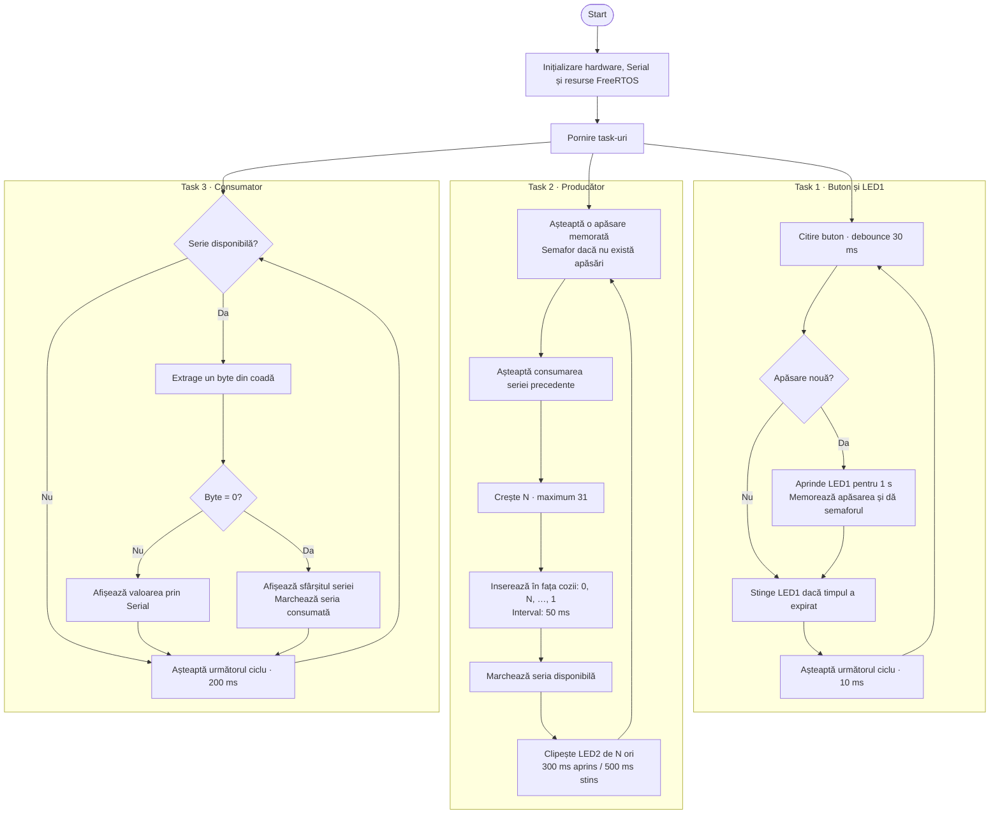

# Diagramă de flux — Lab 2.2 FreeRTOS

Cele trei task-uri se execută concurent.

```mermaid
flowchart TD
    S([Start]) --> I["Inițializare hardware, Serial și resurse FreeRTOS"]
    I --> R["Pornire task-uri"]

    subgraph T1["Task 1 · Buton și LED1"]
        A["Citire buton · debounce 30 ms"] --> B{"Apăsare nouă?"}
        B -- Da --> C["Aprinde LED1 pentru 1 s<br/>Memorează apăsarea și dă semaforul"]
        B -- Nu --> D["Stinge LED1 dacă timpul a expirat"]
        C --> D
        D --> E["Așteaptă următorul ciclu · 10 ms"]
        E --> A
    end

    subgraph T2["Task 2 · Producător"]
        F["Așteaptă o apăsare memorată<br/>Semafor dacă nu există apăsări"] --> G["Așteaptă consumarea seriei precedente"]
        G --> H["Crește N · maximum 31"]
        H --> J["Inserează în fața cozii: 0, N, …, 1<br/>Interval: 50 ms"]
        J --> K["Marchează seria disponibilă"]
        K --> L["Clipește LED2 de N ori<br/>300 ms aprins / 500 ms stins"]
        L --> F
    end

    subgraph T3["Task 3 · Consumator"]
        M{"Serie disponibilă?"}
        M -- Da --> N["Extrage un byte din coadă"]
        N --> O{"Byte = 0?"}
        O -- Nu --> P["Afișează valoarea prin Serial"]
        O -- Da --> Q["Afișează sfârșitul seriei<br/>Marchează seria consumată"]
        M -- Nu --> U["Așteaptă următorul ciclu · 200 ms"]
        P --> U
        Q --> U
        U --> M
    end

    R --> A
    R --> F
    R --> M
```

Afișările Serial sunt protejate prin mutex; coada livrează valorile în ordinea **1, 2, …, N, 0**.
